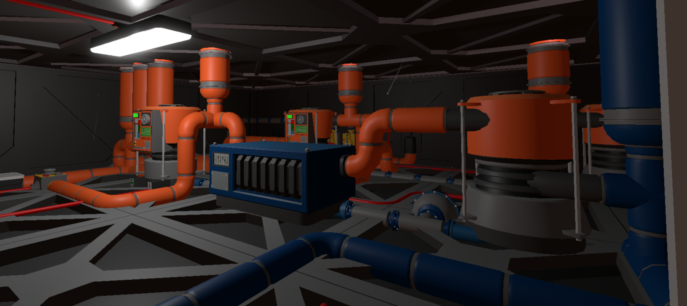
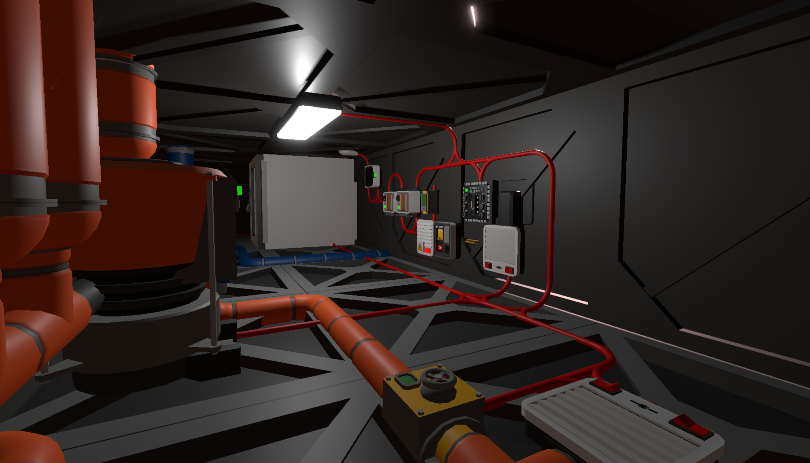
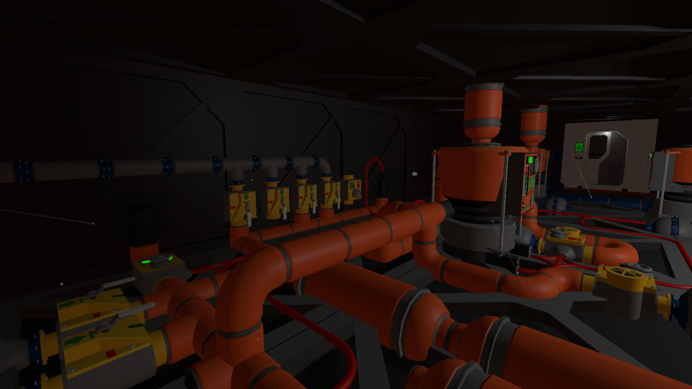
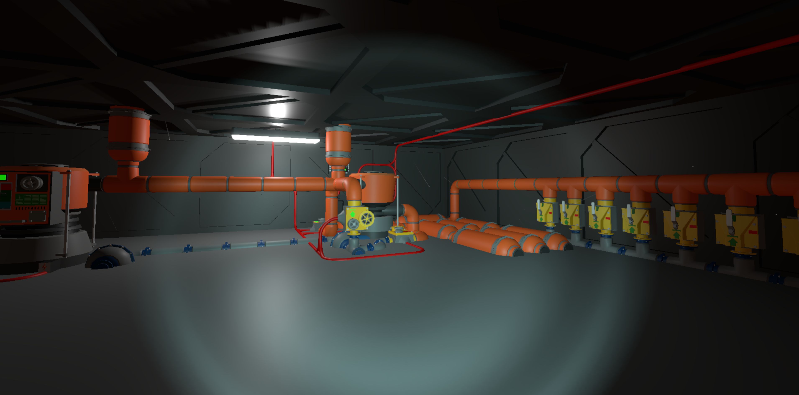
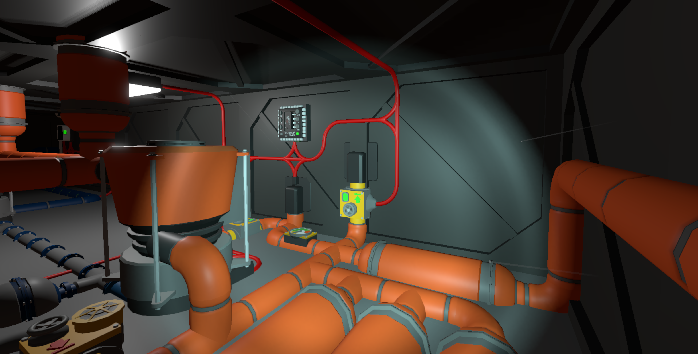
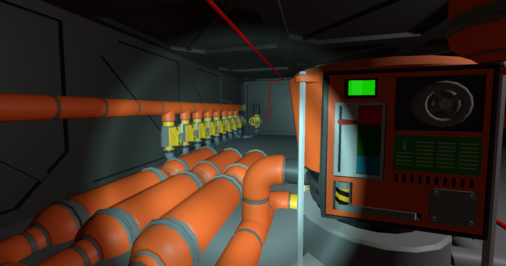

Vulcan Coolant Setup
--------------------
- Per setup
    - 1 condensation chamber
      - 6kPA
      - Gas Exchange: Pure pollutants, from night cold air, after first stage of extraction
        - First Stage:
          - Suck in Air at night
          - Compress to xxxkPA to liquidify pollutants
          - Condensation valves to move liquid from gas pipe to liquid pipes
          - Expansion valves into new gas pipe network.  This network is the condensation chamber "Gas Exchange Port"
    - 1 evaporation chamber
      - Fill with Pure Pullants (originally from the gas Exchange port of the Condenation network)
      - You should have this basically disconnected while in full operation.
      - Need to have enough pressure to pressureize the condensation champber to its setting (6Mpa) and have enough gas in the pipe network to continually loop from gas to liquid
      - This gas exchange port:
        - Contents: anything 'safe' we choose CO2 on vulcan. 
        - Be careful on freezing points.  You can set the evaporation chamber to a pressure to
        which your coolant line won't freeze in the gas exchange port.  Do this by looking up the Phase Change diagram for the input liquid/gas and pick a pressure to which the temp is above the freezing point of the gas exchange port.
- For our base ... we required 5 of these setups.
  - 3 I belt as defined here.
  - 1 Teammate built with a different 'theory' behind the cooling setup.
  - 1 for our Advance Furnance Coolant (to cool nitrogen)

## Images

