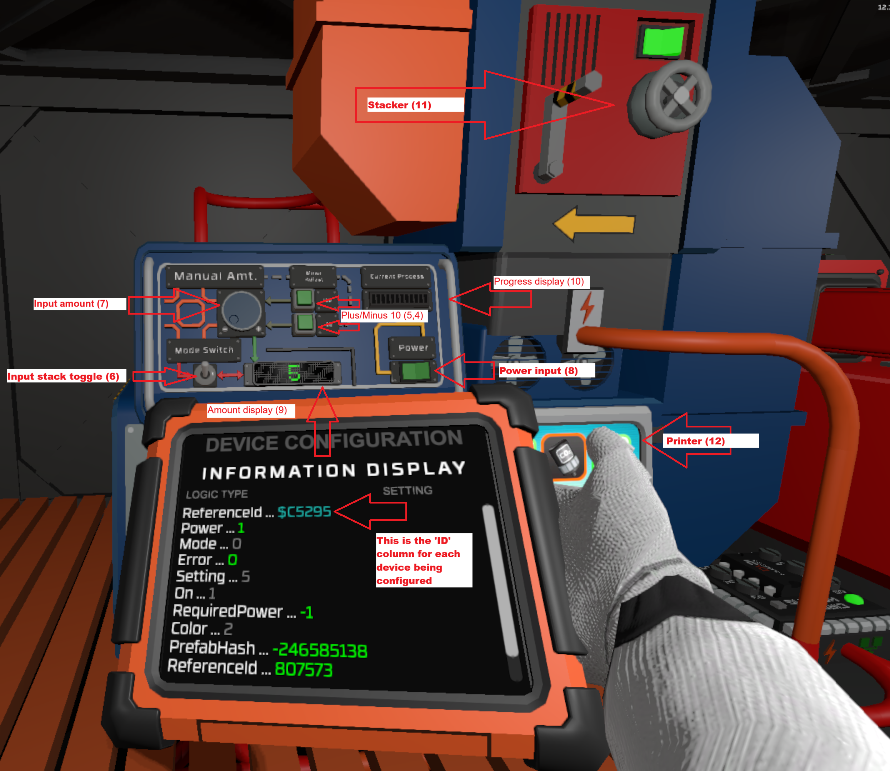
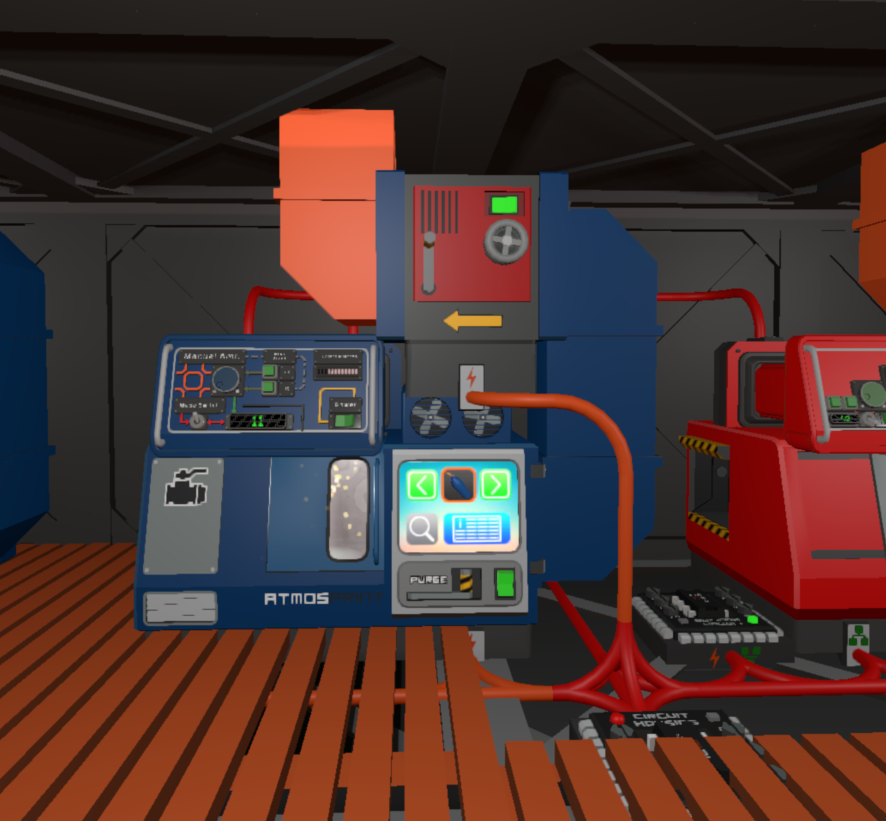

Setup instructions
===
## Required hardware
1. Console mod (not required, optional but makes it looks nice and easier to setup)
2. 2 Console Mod Displays (or Consoles for LED / Percentage view)
3. 5 Console Mod Inputs
   - 2 Buttons -> +/- 10 for amounts
   - 1 Amount Dial -> For manual input, how many to print... Configure max to some number like 500, to have a max amount of items to be able to print
   - 1 Mode Flip Switch (To switch between manual and stack mode)
   - 1 On/Off switch (so that the machine may function like normal)
4. 2 IC Housing (though 1 is used only for setup and may be removed/turned off when done)
    - 1 IC Housing/Chip - [controller chip](./VCIC%20-%20Printer%20Control.ic10)        - The actual code to control the fabrication room
    - 1 IC Housing/Chip - [configuration chip](./VCIC%20-%20Printer%20Setup.ic10) - To tell the other chip what fabricatorto control
5. All devices on 1 logistical data network
6. 1 stacker per fabricator
7. Tablet with the Configuration Chip
    - This way you can identify all of the devices

## Hardware example Pic



## Software Setup
1. Install the controller chip:
- Add the [controller chip](./VCIC%20-%20Printer%20Control.ic10) to the housing.
- Optionally name the housing so that you can easily find it for the setup chip
2. The setup chip is:
- [View Code](./VCIC%20-%20Printer%20Setup.ic10) 
- Memory Should reference the code chip.  It changes the 'stack' of the code chip with the items under control of that controller chip
    - In the setup code, the `$<string>` means the "ReferenceId" (If you use the ReferenceId in the tablet that already has the dollar you add the dollar sign, if you use the decimal number version of ReferenceId, you do not need the `$` (just match what the tablet says)
```
alias Memory d0

put Memory 0 2 # number of fabricators <<<< YOU NEED TO EDIT THIS TO HOW MANY YOU HAVE >>>>

# fabricator 1 (Autolathe1)
put Memory 1 $1488 # Printer (12)
put Memory 2 $3606 # Stacker (11)
put Memory 3 $AE16A # Progress display (10)
put Memory 4 $AE19B # Amount display (9)
put Memory 5 $AE87A # Power input (8)
put Memory 6 $AEF03 # Input amount (7)
put Memory 7 $AE0D8 # Input stack toggle (6)
put Memory 8 $AEEEA # Plus 10 button (5)
put Memory 9 $AEEF9 # Minus 10 button (4)
put Memory 10 $AEF03  # Input amount (3)
put Memory 11 0     # Selected Amount (2)
put Memory 12 0     # Reserve for productionMode (1)
######
### Continue for each fabricator, each one taking 12 'memory' slots.
### So the next one will start at 13 and end at 24
### If you have more than can fit on a chip you can just make a new chip
### and start where you left off in the index (some multiple of 12) + 1
```

- This could change as the code changes ... but when you get errors on the controller chip if it errors on these line numbers it means the follow device wasn't configured properly in the setup.  You can fix the setup, rerun the setup, and then maybe have to take out the controller chip and it back in.

|----------------|-----------------|
| Line Number    |   Device        |
|----------------|-----------------|
| Line 37        | Power Input     |
| Line 64        | DisplayAmount   |

