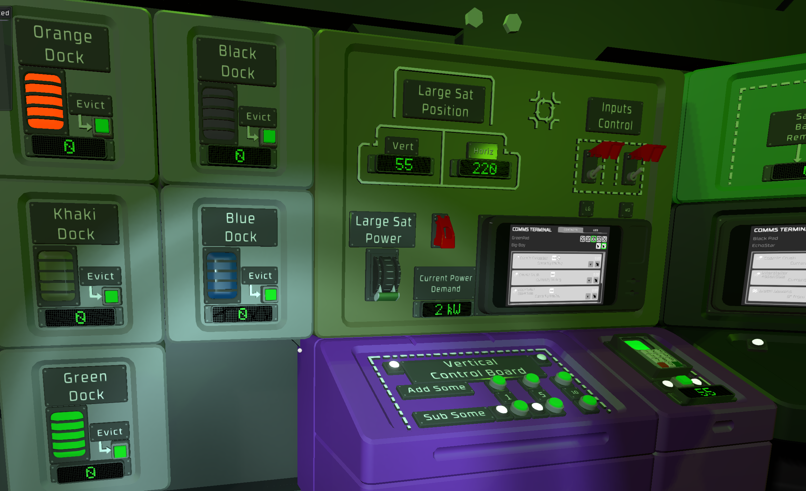
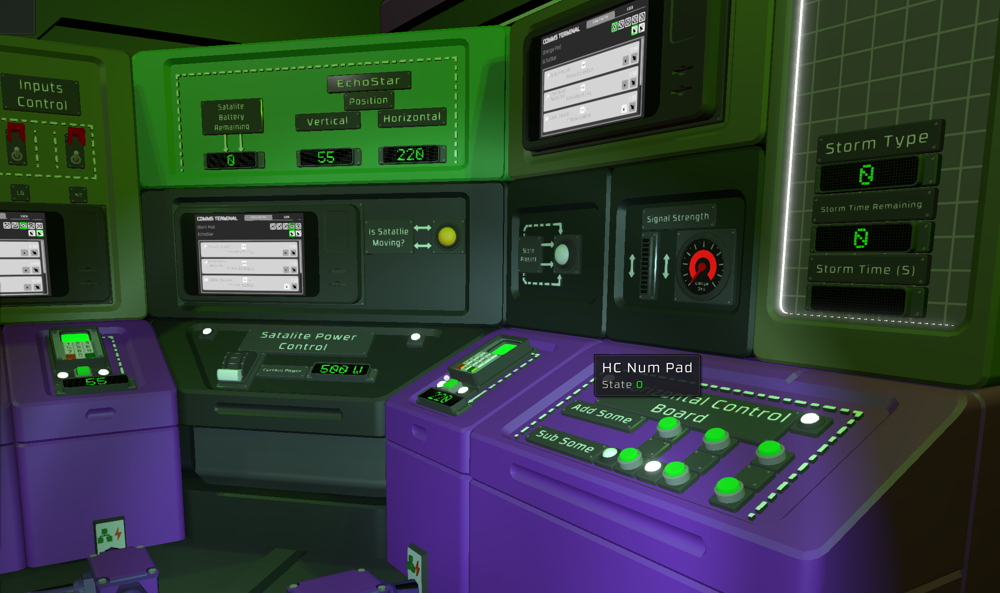
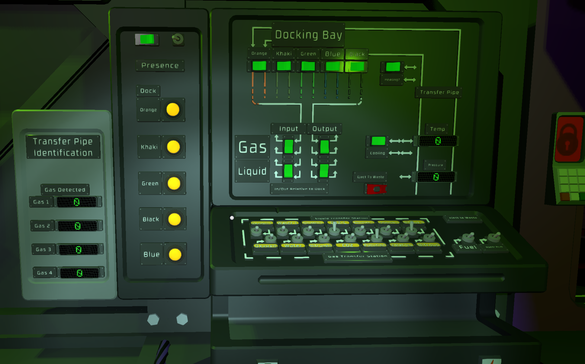

# Trader Control

This script setup requires a number of IC housing ... compared to the trading platforms this is managing, the power usage of these is little anyways.

My partner in crime here, enjoys having many satellite dishes in use, as well as many platforms.  So this manages that.

## Trading Switch Board

This is me attempting to control where gases/liquids go from which trading platform into our main base.  

This is not yet, like everything else a completed system.  Like it has not yet got to the large lights and evict buttons of this .  It does support though lighting up the lights, adjusting the sat dish power utilization, and direction.  The input control toggles controls if the input to change the vert/horiz controls apply to one or both of the Large and medium dish they are controlling.

TODO: Describe setup.

## Other images

## Gas Transfer Switch board

This is not written.  This was just a design that we may have went with.

The gas Dected panel, would display the name of the gases found in the selected pipe coming from the docking bay.

